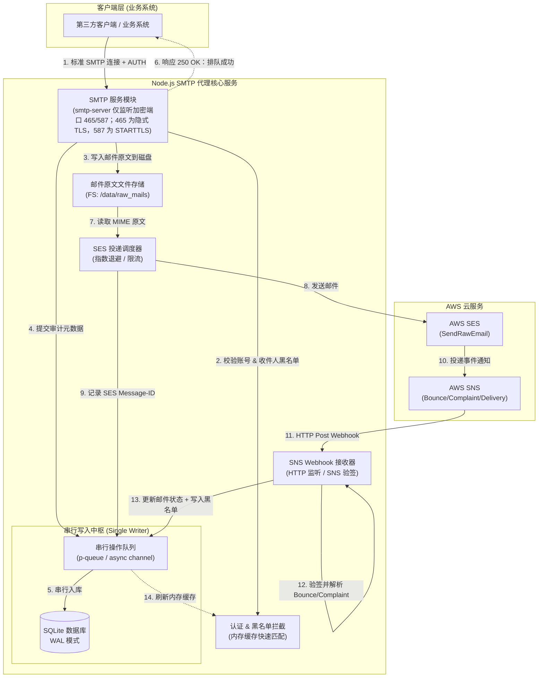
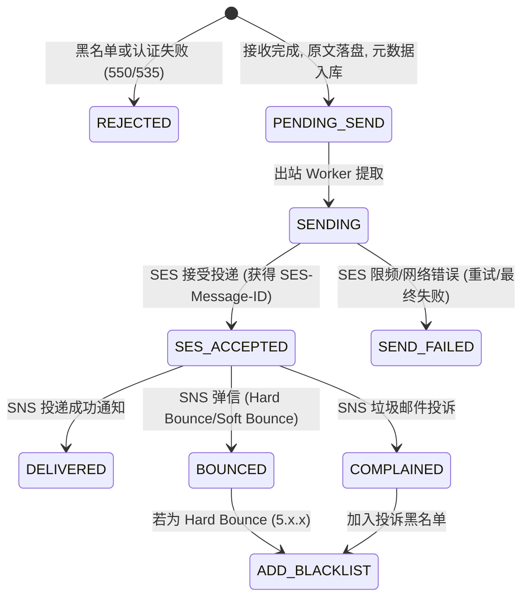

# AWS SES + SQLite 审计型 SMTP 中继代理服务架构设计

## 一、 架构总览与拓扑

本服务是一个专为“标准客户端接入、云端投递、结果审计、自动黑名单过滤”设计的轻量级 SMTP 代理中间件。



---

## 二、 闭环性评估与风险分析

用户的核心设计：**“标准 SMTP 接入 -> SES 投递 -> SNS 反馈 -> 记录内容与结果审计 -> 无效地址入黑名单 -> SQLite 串行读写”**。

### 1. 闭环性评价：**逻辑闭环，但存在 5 个必须解决的工程边界隐患**

| 环节 | 初始设想 | 潜在风险/缺失环节 | 闭环架构优化方案 |
| :--- | :--- | :--- | :--- |
| **收件人黑名单过滤时机** | 仅入库记录 | 若收到发给黑名单的邮件仍调用 SES，会招致 AWS 处罚（SES 极度惩罚 Hard Bounce 率 > 5% 的账号） | **在 SMTP `rcptTo` 阶段直接拒绝（550 Recipient rejected）**，不落盘也不打 SES，直接省钱且保护账号信用额度。 |
| **SES 消息 ID 关联** | 记录邮件内容与发送结果 | 客户端自带的 `Message-ID` 头与 SES 返回的 `sesMessageId` **不一致**。SNS 回调只会携带 `sesMessageId` | SES 接口响应后，**必须将 SES 返回的唯一 ID 记录到本地库**，建立主键/索引，供 SNS 回调更新状态。 |
| **SQLite 性能与大体积阻塞** | 全部读写串行 | 邮件 MIME 原文（含附件）动辄数 MB，若直接将 BLOB 串行塞入 SQLite，单次写入会导致后续所有认证/查询排队，甚至引起 SMTP 握手超时 | **动静分离**：MIME 邮件内容写独立本地文件（如 `/data/raw/<id>.eml`），SQLite 只存结构化元数据（发件人、收件人、主题、文件路径、哈希、状态）。 |
| **并发读与串行写** | 读写全串行 | 若客户端一次性建立 20 个并发 SMTP 连接发信，每个连接都要查库验证账密，全串行读写会导致严重延迟 | **开启 SQLite WAL 模式**（Write-Ahead Logging）：**并发只读 + 独占单线程写队列**；敏感热点（黑名单、鉴权用户）常驻内存 Set/Map。 |
| **SNS 订阅握手与真实性** | 接收 Webhook 结果 | SNS 首次配置必须处理 `SubscriptionConfirmation`（自动访问 `SubscribeURL`）；且任何外网能访问的 HTTP 端口可能被伪造回调 | 必须引入 **SNS 消息签名校验**，并自动应答 SNS 的订阅握手请求。 |

---

## 三、 数据库与队列架构（SQLite 轻量化保障）

为了实现 SQLite 的超低开销且永不出现 `SQLITE_BUSY` 锁定冲突，采用如下设计：

### 1. WAL 模式与动静解耦
- **存储分离**：
  - **文件系统**：`/data/mails/{YYYY-MM}/{uuid}.eml` 存储完整的原始 RFC5322 MIME 数据。
  - **SQLite**：仅存储关联 ID、时间戳、投递状态、发件人、收件人、SES 返回的 MessageId 等轻量索引数据。
- **SQLite 模式**：
  - PRAGMA journal_mode = WAL;
  - PRAGMA synchronous = NORMAL;
  - PRAGMA cache_size = -64000; (64MB 缓存)

### 2. 读写分离模型
- **读操作（无锁并发）**：
  - SMTP 用户鉴权：内存 Map 优先（服务启动时载入），未命中时并发查库。
  - 黑名单校验：内存 `BloomFilter` 或 `Set<string>` 毫秒级匹配，完全不走数据库 IO。
- **写操作（串行队列）**：
  - 采用单一工作线程/单消费队列（如 `p-queue` 并发度设为 `1`）。
  - 所有需要写入的操作（邮件生成排队、SES 返回 MessageId 记录、SNS 状态回填、黑名单追加）统一推入队列，按序单连接写入。

---

## 四、 开源生态推荐与选型组合

利用 Node.js 成熟的底层网络和邮件生态，可直接组合以下经过高度验证的开源库，避免重复造轮子：

| 模块 | 推荐开源项目 | 说明与优势 |
| :--- | :--- | :--- |
| **SMTP 服务端引擎** | [`smtp-server`](https://github.com/nodemailer/smtp-server) | Nodemailer 官方维护。原生支持 STARTTLS、PLAIN/LOGIN 认证流式数据接收（Stream）、连接限频。极为稳定。 |
| **MIME 邮件解析** | [`mailparser`](https://github.com/nodemailer/mailparser) | 流式解析邮件 Header（From、To、Subject、Message-ID）并分离正文与附件，无需自行编写复杂正则。 |
| **AWS SES SDK** | [`@aws-sdk/client-ses`](https://github.com/aws/aws-sdk-js-v3) | AWS 官方 SDK v3。使用 `SendRawEmailCommand`，可以直接投递客户端生成的原始 EML 文件流，完整保留 DKIM/签名。 |
| **SNS 验签处理** | [`@aws-sdk/sns-validator`](https://github.com/aws/aws-js-sns-message-validator) | AWS 官方维护，自动验证 SNS HTTP 请求的证书指纹与加密签名，过滤非法伪造请求。 |
| **SQLite 驱动** | [`better-sqlite3`](https://github.com/WiseLibs/better-sqlite3) | Node.js 生态中最快、最可靠的 SQLite 库。使用同步调用（Synchronous C++ 绑定），天生消除回调陷阱，配合单写入队列性能极高。 |
| **Webhook 接收服务** | [`fastify`](https://github.com/fastify/fastify) | 相比 Express 更加轻量高效，处理 SNS 回调几乎无额外开销。 |
| **串行队列调度** | [`p-queue`](https://github.com/sindresorhus/p-queue) | 内存优先级队列，设置 `{ concurrency: 1 }` 即可实现精确的串行化调度。 |
| **日志与审计输出** | [`pino`](https://github.com/pinojs/pino) | 极速 JSON 日志器，支持异步日志落盘，对事件驱动服务性能影响极小。 |

---

## 五、 详细状态机与数据流设计

### 1. 邮件生命周期状态机



### 2. 核心数据表设计（DDL 预览）

```sql
-- 1. 客户端 SMTP 认证账号表
CREATE TABLE IF NOT EXISTS smtp_users (
    id INTEGER PRIMARY KEY AUTOINCREMENT,
    username TEXT UNIQUE NOT NULL,
    password_hash TEXT NOT NULL,
    is_active INTEGER DEFAULT 1,
    created_at DATETIME DEFAULT CURRENT_TIMESTAMP
);

-- 2. 邮件审计主表
CREATE TABLE IF NOT EXISTS email_audits (
    id TEXT PRIMARY KEY,                       -- 本地生成的 UUID (追踪号)
    client_username TEXT NOT NULL,             -- 哪台业务系统/用户发起的
    client_ip TEXT,                            -- 发起方 IP
    mail_from TEXT NOT NULL,                   -- 发件人
    rcpt_to TEXT NOT NULL,                     -- 收件人 (逗号分隔或按收件人拆行)
    subject TEXT,                              -- 邮件主题
    client_message_id TEXT,                    -- 客户端自带的 Message-ID
    ses_message_id TEXT UNIQUE,                -- AWS SES 返回的 MessageId (索引关键)
    raw_path TEXT NOT NULL,                    -- 磁盘 EML 原文相对路径
    raw_size INTEGER NOT NULL,                 -- 邮件字节大小
    status TEXT NOT NULL DEFAULT 'PENDING',    -- PENDING, SES_ACCEPTED, DELIVERED, BOUNCED, COMPLAINED, FAILED
    error_message TEXT,                        -- 失败具体原因
    created_at DATETIME DEFAULT CURRENT_TIMESTAMP,
    updated_at DATETIME DEFAULT CURRENT_TIMESTAMP
);
CREATE INDEX IF NOT EXISTS idx_email_ses_id ON email_audits(ses_message_id);
CREATE INDEX IF NOT EXISTS idx_email_status ON email_audits(status);

-- 3. 黑名单表
CREATE TABLE IF NOT EXISTS email_blacklist (
    email TEXT PRIMARY KEY,                    -- 小写规范化的邮箱地址
    reason TEXT NOT NULL,                      -- HARD_BOUNCE / COMPLAINT / MANUAL
    bounce_type TEXT,                          -- Permanent, Undetermined
    bounce_sub_type TEXT,                      -- General, NoEmail, Suppressed...
    ses_message_id TEXT,                       -- 触发该黑名单的 SES 消息 ID
    created_at DATETIME DEFAULT CURRENT_TIMESTAMP
);

-- 4. 投递事件追踪表 (一次发送可能有多次事件)
CREATE TABLE IF NOT EXISTS delivery_events (
    id INTEGER PRIMARY KEY AUTOINCREMENT,
    audit_id TEXT NOT NULL,                    -- 关联 email_audits.id
    ses_message_id TEXT,
    event_type TEXT NOT NULL,                  -- Send, Delivery, Bounce, Complaint
    event_payload TEXT NOT NULL,               -- SNS 返回的原始 JSON (完备审计)
    created_at DATETIME DEFAULT CURRENT_TIMESTAMP,
    FOREIGN KEY(audit_id) REFERENCES email_audits(id)
);
```

---

## 六、 关键业务场景与处理策略

### 1. 认证与发信拦截（最前置环节）
- 客户端发送 `AUTH LOGIN / PLAIN`：SMTP 模块拦截校验用户名密码。
- 客户端发送 `RCPT TO:<user@example.com>`：
  - 提取目标邮箱，做小写化归一。
  - 先查内存中的 `BlacklistSet`（O(1) 速度）。
  - 若命中黑名单，直接向客户端返回：
    `550 5.1.1 Recipient address rejected: Address is in suppression list`。
  - **收益**：避免后续所有解析、落盘、AWS 调用，零成本拦截无效发信。

### 2. 邮件接收与入库（串行化写）
- 客户端发送 `DATA`：
  - 通过 Node.js Stream 将数据流一边写入临时 `.eml` 文件，一边通过 `mailparser` 提取头信息（From/To/Subject/Message-ID）。
  - 写入成功后，向串行队列提交一个写任务：在 `email_audits` 插入初始状态 `PENDING`。
  - 随后向客户端响应 `250 2.0.0 OK: queued as <uuid>`。

### 3. SES 出站投递与重试
- 异步工作流读取 `PENDING` 邮件，调用 `@aws-sdk/client-ses` 的 `SendRawEmailCommand`。
- 获取到 AWS 返回的 `MessageId` 后，向串行队列提交更新任务：
  - 更新 `email_audits.ses_message_id = :sesId, status = 'SES_ACCEPTED'`。
- **如果遇到限流（Throttling 400）**：
  - 采用指数退避重试（Exponential Backoff），保护 SES 发送速率在许可的 Rate Limit（如 14 封/秒或更高速率）内。

### 4. SNS 反馈与黑名单自动填充
- Fastify 暴露 `/webhook/aws-sns`。
- 接收到请求后，使用 `@aws-sdk/sns-validator` 校验有效性。
- 如果是 `SubscriptionConfirmation`：自动向 `SubscribeURL` 发起 GET 请求完成绑定。
- 如果是 `Notification`：
  - 解析出 `eventType`（`Bounce` / `Complaint` / `Delivery`）。
  - 提取其 `mail.messageId`。
  - 封装串行写入任务：
    1. 根据 `ses_message_id` 找到对应的 `email_audits` 记录。
    2. 插入一条原始记录至 `delivery_events`。
    3. 更新主表状态为 `DELIVERED` / `BOUNCED` / `COMPLAINED`。
    4. **若是 Hard Bounce（如 `bounceType === "Permanent"`）或投诉**：
       - 向 `email_blacklist` 插入该收件人邮箱。
       - 同步向内存的 `BlacklistSet` 添加该邮箱（热更新缓存）。

---

## 七、 总结

1. **闭环性**：该架构将“客户端协议握手 -> 本地快速校验 -> 异步云端投递 -> 云端事件回调 -> 自动封禁更新 -> 审计溯源”串联成完整的自愈生态。
2. **轻量与高稳定**：
   - 原始邮件正文落盘，SQLite 只承载结构化元数据；
   - SQLite 启用 WAL 模式，配合 `p-queue` 单写入队列，从根源上杜绝了数据库锁争用与死锁问题；
   - 依赖项全部采用官方或顶级工业级开源库（`smtp-server`、`better-sqlite3`、`fastify`、`@aws-sdk`），开发量小且极其稳定。
